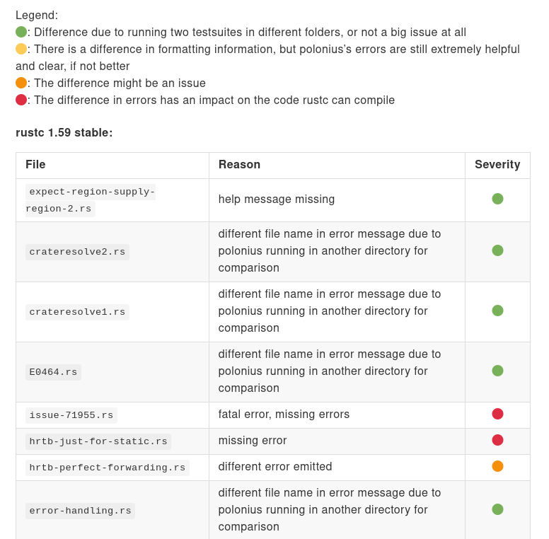
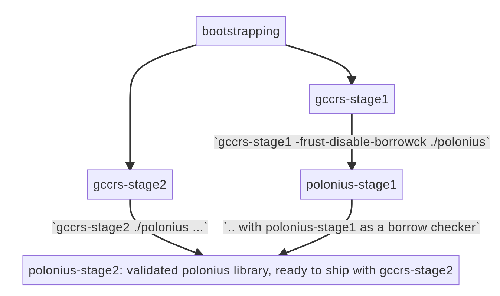
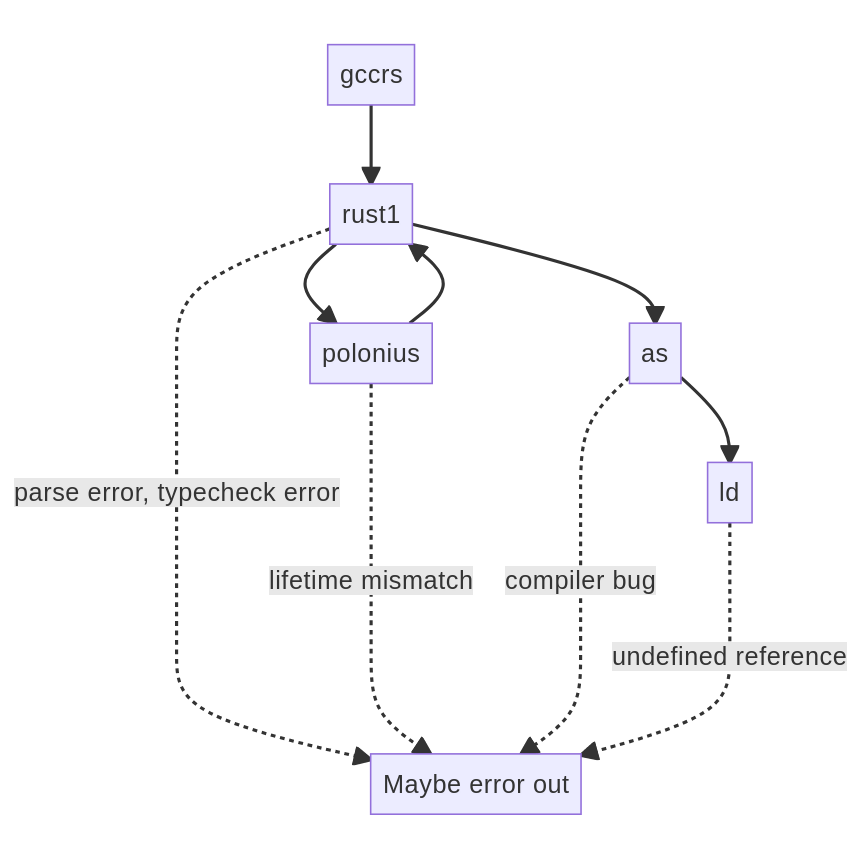

_FIXME_: Add logo above in footer and header
_FIXME_: Add guard page

# Embecosm Rust-GCC - Fixed time mission

_FIXME_: Fix the title

## Thanks

I'd like to thanks to Open Source Security and Embecosm for funding us to work on this project. Jeremy Bennett, for his management and the experience he brought to our development, and Brad Spengler, for being kind and benevolent.

I would also like to thank the entire Embecosm team for being so nice and caring towards me.

Particularly, I would like to thank Philip Herron for being my mentor, manager and especially friend when working on this project.

I would also like to thank my girlfriend for being so supportive and helpful during my stay in Germany.

\newpage

## Introduction

Currently, not many systems programming native language. But Rust is coming. However, only one implementation! Contribute to a second implementation (no details as that is for the Subject part)

In our current programming ecosystem, not many programming languages are usable to target small embedded architectures as well as large multithreaded applications. These languages, where speed of execution is a major focus, are mostly comprised of C and C++.

These two languages can be categorized as "systems-oriented", and "native", meaning that they are able to target even the lowest level of programming and are compiled directly to native instructions for the CPU. Programs compiled using these languages offer very small overhead and are extremely fast, at the cost of increased mental load for the programmer. What these languages are not, however, is "safe". A recent study conducted by Microsoft ([*source*][1]) showed that around 70% of bugs found in their software were "memory issues", where memory is not handled properly by the programmer: memory leaks, use-after-frees, double-frees, out-of-bounds acesses... are all common C/C++ programming mistakes that in turn can lead to vulnerabilities, exploitable by attackers. These numbers are not due to Microsoft's lack of talent: The Google Chrome project reported the exact same number two years ago ([*source*][2]).

This issue has lead numerous companies to invest in programming language research, with the hopes of creating a safe, fast, systems-oriented native programming language, the most notable being Rust.

Rust is still quite a young programming language, being only around 15 years old, but offers a competitive alternative to C and C++. It focuses on safety as well as speed of execution, achieving speeds similar (or faster in some cases!) to programs written in C or C++. Furthermore, it also targets the embedded market, providing more expressivity than C.

However, a stark difference with C/C++ and brake to Rust's adoption is the lack of specification or standard. Some companies do not consider the language stable or mature enough to earn a place in their technological stack. Furthermore, only one implementation of the language currently exists, the official `rustc` compiler. This compiler is written in Rust and thus faces bootstrapping issues. It also uses `LLVM` as its compiling framework, making it available on a lot of hardware architectures but not all.

In an effort to improve the reach of the language, be it in terms of the amount of people using it or for more niche architectures to use Rust programs, an alternative compiler is being developed. This compiler, `gccrs`, aims to integrate the Rust language among the GNU Compiler Collection project. The GNU Compiler Collection (GCC) contains multiple compilers for multiple languages, such as C (`gcc`), C++ (`g++`), Fortran (`gfortran`) or Ada (`gnat`). It is a pillar of the free software movement, making it more engaged than "regular" open source projects, and has been developed for more than 30 years, enabling it to target a multitude of architectures.

The GCC project is an old, complex codebase written in C++11, of around 19 million lines of code, making any changes to it extremely complex but also extremely interesting.

The goal of this internship was, overall, to contribute to the state of the compiler. More specifically, some complex Rust concepts such as macros, privacy restrictions or const generics were not handled yet, and needed to be worked on to achieve a valid Rust implementation as soon as possible.

_FIXME_: Add more? Yes! Talk about goal of compiling standard Rust library

[1]: https://www.zdnet.com/article/microsoft-70-percent-of-all-security-bugs-are-memory-safety-issues/
[2]: https://www.chromium.org/Home/chromium-security/memory-safety/

\newpage

## Subject

The project originally started in 2014. However, the Rust language was not yet stable and saw constant changes, which made it extremely difficult to catch up to `rustc`. Due to this the project was put on hold for a time.

In 2019, Philip Herron started work on `gccrs` again and quickly obtained funding from Open Source Security to work on the project full-time. Philip has a lot of experience dealing with complex financial projects as well as compilers, with numerous contributions to `gcc` and alternative frontends already developed.

I joined the project one and a half year ago, in February 2021. I've always been very interested in compilers and Rust, and had already contributed to `rustc` as well as an alternative compiling backend ([`rustc-codegen-cranelift`][3]). `gccrs` seemed like an interesting project with very interesting goals, a lot of which are also very important to me.
Later in 2021, I applied as a Google Summer of Code student to contribute to `gccrs`, and did so under the mentoring of Philip Herron. My project focused on integrating Rust's build system tool, `cargo`, to use `gccrs` as a compiler ([*project link*][4]). Once the project was finished, I got back to contributing to the compiler itself, focusing on the module system, for which I gave a talk at EPITA during the LSE Winter Days ([*link*][5]).

Soon after, Philip informed me that Brad Spengler from Open Source Security was looking into funding another engineer to work on the project. I was extremely interested in the offer, as I had grown very fond of the project and its community. Furthermore, this was a fantastic opportunity as compiler engineer jobs for open source projects are extremely hard to come across. The compiler still has a lot of interesting areas to work on, and every contribution counts. With dedication, it is extremely easy to make your mark on the project and learn tremendously while doing it. I accepted the very generous offer, and started working as an Embecosm employee, funded by Open Source Security.

While working on compilers does not directly relate to my major, it is still an extremely important subject. Embedded Software Engineers rely on compilers to produce safe, efficient and correct code, able to work on systems with very restricted resources. Rust, due to its focus on performance, is a perfect fit for embedded development as has been proved a number of times already. However, it still suffers from relying on `LLVM`, which does not support as many architectures as GCC. Working on an effort to add Rust to GCC means increasing the reach of the language, making it available on basically every platform shipping with a GCC compiler from the last 15 years.

Finally, an important part of embedded systems is systems programming: Low-level, complex, important pieces of code used to build more software. Compilers are an important part of systems programming, and face a lot of the challenges faced by low-level programmers.

[3]: https://github.com/bjorn3/rustc_codegen_cranelift
[4]: https://github.com/rust-gcc/cargo-gccrs
[5]: https://www.youtube.com/watch?v=KeX6q_s3Z-s?t=441

_FIXME_: Can we add anything more to this? A little more content?

\newpage

## Positioning

Open Source Security aims at enhancing security in core open source components used in the tech industry. Such components include Linux, the most used operating system in servers and datacenters in the world. The company fights vulnerabilities in multiple ways: Training, detection and bugfixing. Potentially vulnerable code can be identified in a number of ways: Static analysis and attentive reviews are the most common among them. One tool used to develop new static analysis passes and improve existing ones is compiler plugins: GCC offers ways for users to plug various pieces of code in its backend, allowing security researchers to search a code's GCC representation, while it is being compiled, for dangerous patterns.

{ width=75% }

To understand at which level these plugins operate, one needs to understand how compilers typically work. First, the user's code, written in their favorite language, gets parsed and translated into an abstract syntax tree (AST). This tree represents the program in a different way, assigning each programming operation (addition, function call, creation of a variable...) to a type of "node" inside the compiler. This AST is then lowered to an internal, high level intermediate representation (HIR). This process usually involve various passes such as name resolving, disambiguation or macro expansion. The HIR, usually more detailed than the AST, gets through another set of transformations: type-checking, some optimisations, some lints, errors for the user about their mistakes, warnings... Finally, this HIR is lowered to a low-level intermediate representation. Of course, all compilers are different: `rustc` lowers its HIR to MIR (mid-level intermediate representation) before lowering it to LLVM IR (`LLVM`'s intermediate representation), while, GCC compilers usually lower their HIR to GCC's intermediate language, `GENERIC` or `TREE`. This low-level representation is then optimized, analyzed, maybe inlined... and gets finally transformed into assembly language.

GCC plugins operate on `GIMPLE`, a subset of the `GENERIC` representation used by all GCC compilers. Simply put, this means that GCC plugins written to target C programs such as the Linux kernel can also be used for all languages present in the GCC project. With `gccrs`, they could also be used for Rust programs, enabling even more safety than what the language already offers. Open Source Security, which has already written numerous of these plugins, aims to use them for upcoming Rust drivers in the Linux kernel, as the language is currently being integrated in the operatin system with the Rust-for-Linux project ([*link*][6]).

Embecosm, on the other hand, is a compiler company: They are tasked with integrating the GCC and LLVM projects for various customer architectures, or even new architectures entirely. The company's engineers have intimate knowledge of these compilers and help guide the `gccrs` project in the right direction by providing management and feedback. Furthermore, the company is extremely interested in the Rust language, providing support, training, and contributing to its existing implementation whenever possible.

_FIXME_: Add more on Embecosm?

2. People interested in funding the project maybe?
3. Rust-for-Linux!

[6]: https://github.com/Rust-for-Linux

\newpage

## Course of the internship

Over the course of this internship, as well as all prior and future compiler development, an important part of the work can be resumed as research. That research includes figuring out the necessary features to implement, planning it, splitting it into multiple parallelizable small tasks as much as possible, and then making sure that all possible behaviors are understood in their entirety. For `gccrs`, this usually means three steps:

1. Looking at the Rust book and reference
2. Creating complex, curious, invalid Rust code containing edge-cases
3. Diving deep into `rustc`'s code, analyzing the implementation and understanding it

In practice, these three steps mean having an important knowledge of the language at hand. The reference often refers to other complex pieces of the language, sometimes using important and difficult terms or techniques. Then, writing complex Rust code to figure out the various behaviors is a difficult task. This is not "normal code", but rather pieces of code that stress the compiler. Finally, going through `rustc`'s codebase implies that to do so effectively, you must be familiar with it. In practice, this means being able not only to navigate one huge compiler codebase (GCC) but also a second one, written by very different people in a very different style and language!

Once that effort is done, we need to plan out how to implement it in the compiler. Since implementing a language change in the whole compiler pipeline is a daunting task, it is necessary to break it down. However, this means that we are not able to properly test this new behavior until the entire pipeline can handle it. Writing tests is thus painful, often going back to them later to fix the assertions, or marking them as bogus ones until the behavior is completely implemented.

Finally, another important part of this compiler's development is the community. Like all open source projects, `gccrs` strives because of the people contributing to it or interested in it. In order to nurture that interest and interact with the community, we hold monthly community calls, aimed at discussing what is currently being worked on, what important choices to make, etc.

As an example, we are currently considering the possible ways of getting `gccrs` merged upstream in the main GCC repository. Effectively, this would mean "releasing" the compiler. Since this is a huge decision, we discussed it over the last two community calls, asking members of the GCC community how this process would usually go, what timelines or deadlines we would be looking at, what it would mean for the project... As well as members of the Rust community about how an incomplete compiler would affect the project's image or the Rust ecosystem.

To further the reach of the project, it is also important to showcase it. We achieve this in multiple ways:

1. Regular reports

We publish weekly and monthly reports of the project's progress. These reports often end up on popular programming communities, such as HackerNews or the Rust subreddit forum. They contain technical information, an overview of our progress and details about our implementation. They are also a way to thank contributors and allow them to talk about their work. You can read these reports on Philip's website ([*link*][7]).

2. Talks at conferences

Another way to reach the audience and get them interested in the project is talks. We try to give talks at interesting venues where attendees might want to learn more about Rust, or might be interested in compiler development. In May, we gave a talk at the Live Embedded Event #3. Soon, Philip will give a talk about the compiler at the Linux Plumbers Conference, a famous convention for people interested in open source and systems development. In September, we will also be going to Prague to give a talk at GNU Cauldron, an informal event regrouping other GNU and GCC developers to talk, work and discuss together.

3. Trade fairs

Finally, Embecosm also gave us a platform to promote the project at a famous trade fair, Embedded World. This meetup is comprised of very famous embedded companies, clients and investors. I was present during the three days of this event, presenting `gccrs` and our hopes for the project. This lead us to meeting important and interesting people from companies such as Adacore, Ferrous Systems, Intel or Open SUSE, who might later be interested in funding the project or contributing to the engineering effort.

As a side-note, we are also working towards hiring more people at Embecosm and/or to work on `gccrs`. In that regard, I have helped conduct two of Embecosm's engineering interviews for positions in our German office, asking them technical questions or questioning them about their compiler experience.

[7]: https://thephilbert.io

### Gantt Diagram

1. Add pretty diagram! How? Interlace the PDF? Take a picture?

\newpage

## Engineering approach

### Const generics

"Generics" enable programmers to share behavior across multiple types, usually by taking an underlying type as parameter. To give an example, let's take a regular Rust function, whose purpose is to make a dog eat its food:

```rust
fn eat(doug: Dog) {
    doug.make_noise();
    doug.become_happy();
}
```

Here, the function takes one parameter, `doug`, of type `Dog`. The function then calls the `make_noise` method on our dog, and then the `become_happy` one. Now, let's say that we want to extend this function to work with something else than dogs, for example cats.

```rust
fn dog_eat(doug: Dog) {
    doug.make_noise();
    doug.become_happy();
}

fn cat_eat(garf: Cat) {
    garf.make_noise();
    garf.become_happy();
}
```

We can see that both the `Cat` and `Dog` type allow you to call the `make_noise` and `become_happy` methods. If we were to extend this behavior to horses, then we'd have to copy paste this function once again, naming it differently. If we wanted to make a change to the function, for example by giving it an extra `food: Food` parameter, we would then have to change three functions that are otherwise completely equivalent!

Enter generics: By taking a type as a parameter, you can create multiple copies of the same function which only differ slightly. Due to the complexity of the Rust language, this code is not entirely valid, but this information is not necessary to our explanation.

```rust
//      _____ here!
//     |
fn eat<T>(animal: T) {
    animal.make_noise();
    animal.become_happy();
}
```

We can see that the function has a new bit of syntax next to its name: `<T>`. This indicates that, on top of taking a parameter called `animal`, it also takes a type parameter called `T`. This parameter can only refer to a type. Then, we mark the `animal` parameter as a parameter of type `T`. That type `T` can then become `Dog`, `Cat`, `Horse`, or anything we want!

In Rust, this resolution is done at compile time. The compiler is going to figure out that we would like to call this function with a `Dog`, a `Cat` and a `Horse`, and generate three "copies" of the function with the proper types.

```rust
fn __eat_Dog(animal: Dog) {
    animal.make_noise();
    animal.become_happy();
}
fn __eat_Cat(animal: Cat) { /* same code */ }
fn __eat_Horse(animal: Horse) { /* same code */ }
```

Since this resolution and copying is done during compilation, it is called "monomorphization". As opposed to "polymorphism", which is a more complex concept involving the resolution of these functions while the compiled program is running, and which is not present in Rust.

Nonetheless, you also sometimes want the concept of "generics" to apply to other programming constructs than types, such as values. This is called "const generics" in Rust. Let's look at another example:

```rust
// You want to compute the sum of an array
fn sum(array: &[i32]) -> i32 {
    let mut sum = 0;

    for i in 0..array.len() {
        sum += array[i];
    }

    sum
}
```

This function is good, as it works with arrays of all sizes. However, it does require an extra function call to know the length of the array: `array.len()`. If we are in a situation where we can easily know the size of an array, avoiding that call could net some increase in performance.

In Rust, arrays of a fixed size are marked like so:

```rust
// An array of 3 elements
let array: [i32; 3] = [1, 2, 3];
```

Meaning that we could write the following function:
```rust
fn sum_3(array: &[i32; 3]) -> i32 {
    let mut sum = 0;

    for i in 0..3 {
        sum += array[i];
    }

    sum
}
```

However, if we were to compute the sum of an array of five elements, we would need a different function. Which would basically be a copy of the previous one. This is where const generics come into place:

```rust
//            ___ here!
//           |
fn sum<const N: usize>(array: &[i32; N]) -> i32 {
    let mut sum = 0;

    //           ___ used here!
    //          |
    for i in 0..N {
        sum += array[i];
    }

    sum
}
```

We can now call our `sum` functions with arrays of different fixed sizes: `[i32; 3]`, `[i32; 15]`, etc... and the compiler will generate the necessary functions for us, replacing `N` with the actual size of our array.

```rust
fn __sum_3(array: &[i32; 3]) -> i32 {
    let mut sum = 0;

    for i in 0..3 {
        sum += array[i];
    }

    sum
}

fn __sum_15(array: &[i32; 15]) -> i32 {
    let mut sum = 0;

    for i in 0..15 {
        sum += array[i];
    }

    sum
}
```

This type of generic is extremely powerful and allows for very nice performance gains by relying on the compiler to perform computations rather than the resulting program. They are often used in C++, with the `constexpr` and `consteval` keyword. Rust has added support for them in the 1.50 version, which is quite recent at the time of writing. Incidentally, this meant that `gccrs` still does not support them. I was tasked with looking into their implementation, their behavior, and adding them to the compiler.

The first step was to parse them. Since they use a different syntax than regular generics (`const $name: $type` versus `$name`), our parser did not understand them at all and would produce errors about invalid Rust code. Then, we needed to create new nodes for our AST to understand these const generics, namely two of them:

1. Const generic parameters, which refer to the "declaration" of these const generics:

```rust
fn sum<const N: usize>() { /* ... */ }
```

2. Const generic arguments, which refer to their application, when for example calling a const generic function:

```rust
let my_sum = sum<3>();
let my_sum = sum<{ 3 + 1 }>();

const M: usize = 15;

let my_sum = sum<M>();
```

This lead to another problem, also encountered by `rustc`. When parsing the following statement:
```rust
let my_sum = sum<M>();
```
The parser cannot possibly know whether `M` refers to a generic type or a const generic argument. Later on in the compiler pipeline, we will be able to differentiate because we will know that a const value named `M` has been declared. For now however, that must remain ambiguous.

Our new AST type is thus split in two: Either it is a const generic argument for sure (`15`, `{ 3 + 1 }`, `{ M }` are necessarily const generic arguments according to the Rust language), either it is a type or a const generic.

Right after in the compiler, before AST lowering, the AST undergoes "name resolution". A pass which ties usages of a name and its origin. This is the place where disambiguation happens for our const generic arguments.

Once these nodes are disambiguated, they are lowered to newly-added HIR nodes. These nodes then undergo a variety of transformations such as typechecking, ensuring that the generic is of an allowed type, and that the expression given in const generic argument fits the type of the const generic parameter.

Finally, these nodes are compiled to TREE and go through "constant evaluation": This process allows using almost any construct of the language for constant expressions: Conditionals, loops, functions... And one of our Google Summer of Code student's project is to port over `g++`'s constant evaluator to `gccrs`. Once that project is done, we will be able to plug the TREE constant expressions into this evaluator, effectively performing constant evaluation at compile-time.

### Borrow-checking

Another even more important feature of the `rustc` compiler is its borrow-checker, a static analysis pass whose role is to avoid memory vulnerabilities mentioned in this report's introduction. To be more precise, the borrow-checker prevents double-frees, use-after-frees, dangling pointers, memory leaks, pointer aliasing errors, immutability violation, double mutability, data-races, and more. A lot of Rust programmers consider it to be the main attraction and their favorite part of the language. Without it, Rust would not be as safe as it is. However, since it is simply an "error reporting pass", similar to how a C++ compiler with static analysis could warn you about unclosed file descriptors or out-of-bound writes, it is not *necessary* to produce assembly code. On account of this fact, the planning for the compiler's progress established in 2019 by Philip did not initially plan on integrating a borrow-checker. This choice makes sense: Adding this feature is extra effort, which does not in itself benefit the compiler, simply the user experience. Furthermore, upcoming compilers are usually first tasked with compiling valid code: Proper error messages, error passes and user feedback are not a priority. Finally, adding a borrow-checker would mean adding months, if not years of work on top of the schedule: Funders would certainly not be happy with these timelines.

Nonetheless, shortly after my arrival as an engineer on the project, the question was raised once again. Would `gccrs` *really* be a Rust compiler without a borrow-checker? Philipp Krones, another Embecosm colleague at the time and prominent figure in the Rust community, started arguing with me on his side that a borrow-checker was necessary. That without such a feature, `gccrs`' reputation would be tarnished and never recover, and that a bad image would linger over the project for years. Furthermore, it was clear to us and the rest of the community that Rust without a borrow-checker was *not* Rust, but an unsafe superset of the language. Philip Herron, when faced with this dilemma, took great care of arguing against us despite being convinced that the project needed a borrow-checker. This arguing was done so that all corners would be covered; All possible questions by the funders of the project, answered.

Thanks to his dedication in making sure the project had proper reasons for adding months of work on top of the existing schedule, we spent a few weeks researching what it would mean fo r us to work on this, how to do it, and how to integrate it to `gccrs`.

We realized that we could leverage `polonius` ([link][8]), an alternate implementation of the borrow-checker, developed as a separate Rust library. This library aims to replace the current borrow-checker soon, and is based on "simple" mathematical rules executed in a prolog-like model. We ran the `rustc` testsuite using `polonius` as a borrow-checker, and took note of the differences, marking them in various ways.

{ width=75% }

However, integrating with `polonius` represents a massive effort. It is still closely tied with some information specific to `rustc`'s internal representation, `MIR`. We will need to contribute to `polonius` and maybe even `rustc` in order to bridge that gap and make the library available to our compiler as well. Nonetheless, this solution avoids us having to deal with the complex mathematical theory behind borrow-checking and then implementing it.

When presented with the issue, the funders of the project agreed that it was the right course of action. Thanks to our complete research and planning, as well as good argumentation from Philip Herron and I, they were happy with considering adding a borrow-checker on top of the existing planning. Thus, we will be starting work on this project later on this year. By taking all possible precautions and trying to answer questions in advance, we were able to convince people that might have opposed this idea had we not done our due dilligence.

For more information about how we plan to integrate `polonius` to `gccrs`, look out for a blogpost on the Rust Foundation website ([link][9]) or have a look the various graphs we've produced during our research (figure \ref{polonius} and \ref{polonius-two}).

[8]: https://github.com/rust-lang/polonius
[9]: https://foundation.rust-lang.org/news

## Illustrated analysis

Over the course of this internship, I've had to improve how to work efficiently in a massive C++ codebase.

1. Systems programming
2. Low-level programming
4. Compiler development course?
3. Choice of language? C++, Rust 

\newpage

## Added value of the internship

According to Philip Herron, my mentor during the last few months, I have helped a lot on the project. The original internship plan was as follows:

1. Spend one month developing macro test cases
2. Spend two months working with Philip on adding macro support in the compiler
3. Take ownership inside the compiler
    1. Compiler intrinsics
    2. Uninitialized variable scan
    3. Mutability error scan

In the end, macro support as well as support for macro repetitions was completed in around a month, closing up that milestone which was more complex than at first glance. Then, I dedicated some time into the borrow-checker research, as well as starting to create a proof-of-concept integration with `polonius` within the compiler which proved that it was possible. This took some time but answered a question which lingered on the project for quite a while. Then, Philip assigned me to tackle the privacy pass, which prevents used from accessing functions or structure fields that are not marked as "public", making it possible to have encapsulation within your Rust code. I spent some time marketing the project at Embedded World, which nested a lot of interest for it. Finally, more recently, since I was comfortable with the compiler and proficient in what I was doing, Philip felt comfortable making me a mentor for this year's Google Summer of Code which enabled the project to have one more student working on it this summer.

For our main funder, Open Source Security, I think they are happy with my performance. I helped free Philip of a lot of annoying tasks, and enabled him to work on complex bugs within the typechecker and bring us closer to compiling `libcore`, one of the main components of the Rust standard library.

I still have some work assigned in the compiler until the end of the internship, as I haven't touched on compiler intrinsics yet. I hope to get through it quickly so that I can work on integrating the `polonius` library further.

Regarding my courses at EPITA, this internship has helped strengthen all the concepts that I had been taught. From an external point of view, this project is about contributing and working with an old codebase, the GCC project being around 30 years old. The C++ standard that we are allowed to use in `gccrs` is not the most recent, so a lot of the nice modern features of the language are outside our reach.

My major, embedded systems, is also focused on the usage of low-level programming languages such as C++. Some would argue that it sits at a much higher level than C, which is the primary language being taught in GISTRE, but it is quite lower level than Rust, Haskell or OCaml which are common languages used in compiler design. Because of this, we cannot use some common functional programming techniques that we would really like to employ, such as parser combinators or sum types.

_FIXME_: Move this to previous section?

Since I am more comfortable with imperative languages such as C, or functional languages such as Rust, which we used regularly during our embedded systems courses, it was interesting to have more experience in object oriented programming in C++.

And despite choosing this major, I have always been interested in compiler development which is a subject taught extensively in EPITA, thanks to the Tiger compiler project and LRDE research laboratory.

Finally, contributing to open source projects has always been a big interest of mine during my studies. My major allowed us to do some open source research, contributing to various projects such as Rust-for-Linux, and to write open source drivers in C and Rust for an embedded systems project during the first semester. Being able to keep doing this sort of contribution as my full-time job has been a real eye opener and has secured my career choice.

_FIXME_: Move this to previous section?

## Synthesis and Conclusion

1. I got a job!
2. I enjoyed it so, so much

### Introspection

1. Between the beginning and the end of the internship
    1. I evolved, I feel like I brought a lot to the project, I had a lot of fun and I learned a tremendous amount
    2. Learned to mento GSoC student

### Evolution of your career plans/personal project

1. Confirmation or evolution of your professional project
    1. Confirmed!

### Vision of the business world

1. I will never work in a big company. Small companies all the way

### Annexes




